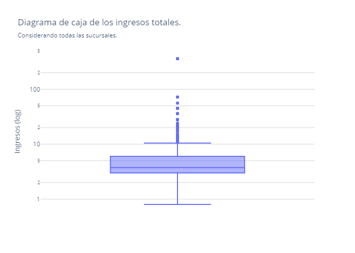
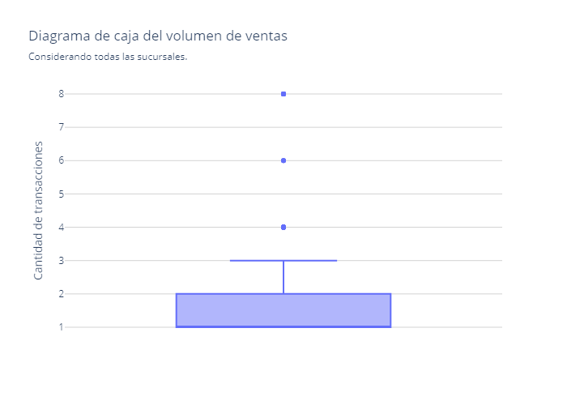

# Análisis de ventas de cafeterías
 


En este repositorio se analizan las ventas realizadas en una cafetería. Los datos fueron obtenidos desde [Maven Analytics](https://mavenanalytics.io/data-playground/coffee-shop-sales).

Los datos representan las ventas de tres sucursales de una cafetería en distintas regiones:
- Lower Manhattan
- Hell's Kitchen
- Astoria

**Pregunta central:** ¿Las tres sucursales se comportan igual, 
o hay diferencias en preferencias de productos y rendimiento?
# Instalación y uso
Este proyecto está hecho en Jupyter usando Python, se deben contar con las librerías o dependencias incluidas en el entorno `machine_learning_env.yml`, estas se pueden instalar mediante el siguiente comando en la terminal (Anaconda requerido):
```shell
conda env create -f machine_learning_env.yml
```
y se activa el entorno con el siguiente comando:
```shell
conda activate machine_learning_env
```
# Descripción de los datos

| Variable         	| Descripción                                                    	|
|------------------	|----------------------------------------------------------------	|
| transaction_id   	| ID único que representa una transacción individual             	|
| transaction_date 	| Fecha de la transacción en formato MM/DD/YY                    	|
| transaction_time 	| Hora de la transacción en formato HH:MM:SS                     	|
| transaction_qty  	| Cantidad de productos vendidos                                 	|
| store_id         	| ID único de la cafetería donde se llevó a cabo la transacción  	|
| store_location   	| Ubicación de la cafetería donde se llevó a cabo la transacción 	|
| product_id       	| ID único del producto vendido                                  	|
| unit_price       	| Precio de venta al público del producto vendido                	|
| product_category 	| Descripción de la categoría del producto                       	|
| product_type     	| Descripción del tipo de producto                               	|
| producto_detail  	| Descripción detallada del producto                             	|

---
## Información relevante
- La base de datos contiene 149,116 registros
- 16 columnas
- Un total de ventas de $ 698,812.33
- El promedio general de ventas fue de $4.69
- El rango de fechas es 01 de enero al 30 de junio de 2023

# Resultados
Dentro de las columnas que incluyen los ingresos y el volumen de ventas se encontraron los siguientes valores atípicos:



En la gráfica superior resalta el valor atípico más extremo para una facturación de $360 en una sola transacción, donde los datos están limitados entre $0.8 y $10.5.



El volumen de ventas todal también contiene valores atípicos, por ejemplo en el extremo superior de la gráfica se aprecia que en una transacción se facturaron 8 artículos.