# Análisis de ventas de cafeterías
 


En este repositorio se analizan las ventas realizadas en una cafetería. Los datos fueron obtenidos desde [Maven Analytics](https://mavenanalytics.io/data-playground/coffee-shop-sales).

Los datos representan las ventas de tres sucursales de una cafetería en distintas regiones:
- Lower Manhattan
- Hell's Kitchen
- Astoria

**Pregunta central:** ¿Las tres sucursales se comportan igual, 
o hay diferencias en preferencias de productos y rendimiento?
# Instalación y uso
Este proyecto está hecho en Jupyter usando Python, se deben contar con las librerías o dependencias incluidas en el entorno `machine_learning_env.yml`, estas se pueden instalar mediante el siguiente comando en la terminal (Anaconda requerido):
```shell
conda env create -f machine_learning_env.yml
```
y se activa el entorno con el siguiente comando:
```shell
conda activate machine_learning_env
```
# Descripción de los datos

| Variable         	| Descripción                                                    	|
|------------------	|----------------------------------------------------------------	|
| transaction_id   	| ID único que representa una transacción individual             	|
| transaction_date 	| Fecha de la transacción en formato MM/DD/YY                    	|
| transaction_time 	| Hora de la transacción en formato HH:MM:SS                     	|
| transaction_qty  	| Cantidad de productos vendidos                                 	|
| store_id         	| ID único de la cafetería donde se llevó a cabo la transacción  	|
| store_location   	| Ubicación de la cafetería donde se llevó a cabo la transacción 	|
| product_id       	| ID único del producto vendido                                  	|
| unit_price       	| Precio de venta al público del producto vendido                	|
| product_category 	| Descripción de la categoría del producto                       	|
| product_type     	| Descripción del tipo de producto                               	|
| producto_detail  	| Descripción detallada del producto                             	|

---
## Información relevante
- La base de datos contiene 149,116 registros
- 16 columnas
- Un total de ventas de $ 698,812.33
- El promedio general de ventas fue de $4.69
- El rango de fechas es 01 de enero al 30 de junio de 2023

# Resultados
En la gráfica siguiente se muestra la distribución conjunta de los ingresos de las tres sucursales:

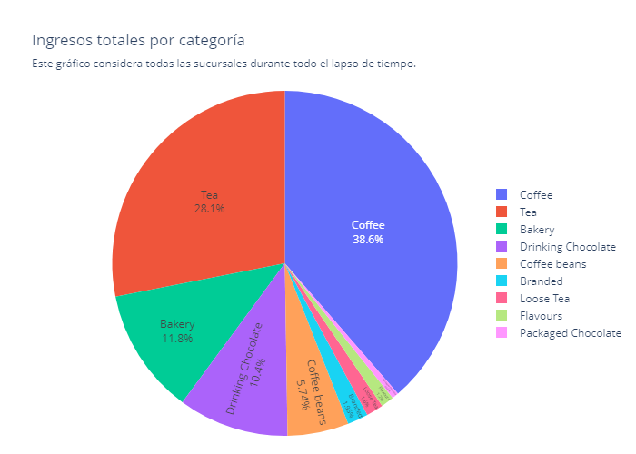

*Coffee* es la categoría dominante, con el 38.6% de los ingresos de todas las sucursales, le siguen *Tea* con 28.1%  y *Bakery* con 11.8%. Por otro lado, los ingresos de *Packaged Chocolate*, *Flavours* y *Loose Tea* son marginales, lo que suguiere que una modificación al menú sobre estos tipos de producto, no resultaría en un cambio significativo.

Desglozando los ingresos globales por producto, como se muestra en la siguiente gráfica, los productos del tipo *Barista Espresso* son dominantes en la generación de ingresos, con 13.1%, le siguen los *Brewed Chai tea* (11%) y *Hot chocolate* (10.4%). En el opuesto se encuentran *Green beans* con apenas 0.19%, seguido por *Green tea* (0.21%) y *Organic chocolate* con 0.24%.

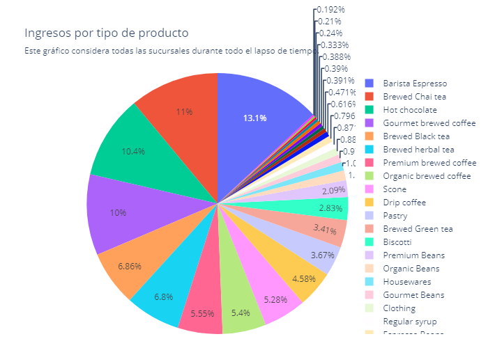

En el top 3 productos que más ingresos reportaron son:

1. Sustainably Grown Organic Lg (Hot chocolate)
2. Dark chocolate Lg (Hot chocolate)
3. Latte Rg (Barista Espresso)

Las proporciones de ingresos netos para cada tipo de porducto se muestra a continuación.

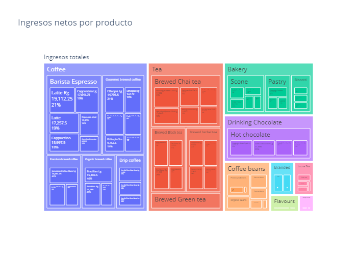

En general, las tres categorías que representan gran parte de los ingresos totales son *Coffee*, *Tea* y *Bakery* con 39%, 28% y 12% respectivamente, al analizar cada una de ellas, se observa que:
- Dentro de las bebidas con café, las que son del tipo *Barista espresso* son las principales fuentes de ingresos.
  - En concreto, el *Latte Rg* (tamaño mediano) es la bebida principal con un 21%.
  - Le sigue el *Cappuccino Lg* (tamaño grande) quien aporta el 19%.
- En el partado de los tés, los tipo *Brewed Chai tea* son los principales.
  - Especialmente el Morning Sunrise Chai Lg, con un 23% de las ventas en ese tipo, esto lo convierte en la bebida a base de té que reporta más ingresos.
- La panadería se posiciona en el tercer puesto, siendo los del tipo *Scone* los panes que más ingresos aprotan.
  - El *Scottish Cream scone* se posiciona como el pan con mejores ingresos, con un 24% dentro de este tipo.
  - Le sigue el *Ginger scone* con 22%.

El producto que reportó más ingresos a las cafeterías fue el chocolate caliente *Sustainably Organic Lg* con más del 3% de las ventas totales. Es importante resaltar que solo cuatro bebidas de chocolate son las que acumulan más del 10% de los ingresos, esto habla sobre las preferencias de los clientes y realmente donde se puede encontrar un producto ancla.

## Analizando los 10 productos con mejores ingresos

Considerando las tres sucursales, estos son los diez productos que reportaron mejores ingresos:

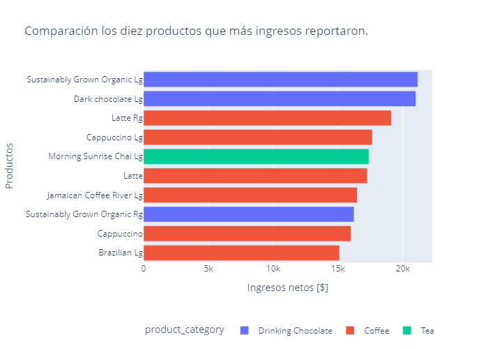

La gráfica anterior muestra que destacan dos bebidas de chocolate: *Sustainably Grown Organic Lg* y *Dark Chocolate Lg*. El ingreso neto promedio de esta muestra es de aproximadamente $17,737.5, con una desviación de la media de $2,064.7 lo cual representa un 11.64% respecto al promedio, esto indica una dispersión moderadamente homogénea.

## Analizando los 10 productos con mejor volumen de ventas

A continuación se muestran los diez productos con mejor volumen de ventas

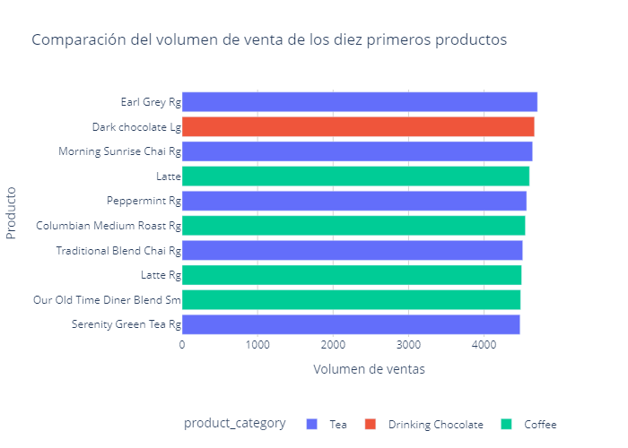

Se puede observar que el volumen promedio de ventas es de aproximadamente 4,570 unidades, con una desviación estándar de casi 82 unidades, es decir, cada uno de estos productos tiene una diferencia de aproximandamente 1.8% respecto al promedio. Esto nos dice que esta muestra de productos es homogénea y consistente entre los próductos líderes Se puede decir que, al menos para este conjunto, el produto más vendido (*Early Grey Rg*) no parece destacar cuantitativamente sobre los demás, es decir no es un valor atípico que distorcione la media.

## ¿Los productos con mejor volumen de ventas generan mayores ingresos?

Primero, comparando los productos con mejores ingresos contra sus volúmenes de ventas como se muestra en la siguiente gráfica:

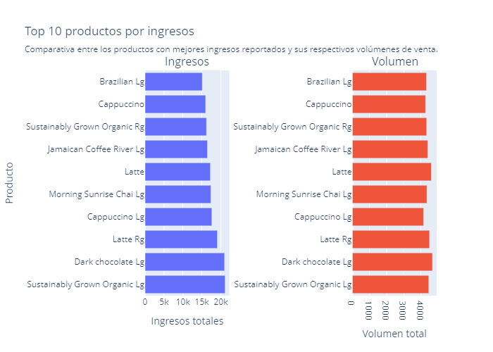

Estrictamente, el producto con mejores ingresos no fue el que vendió más por volúmen. La la variación del volumen vendido respecto al promedio en esta muestra ronda el 11.6%, lo que indica una dispersión poco pronunciada.

Por otro lado, al comparar los productos con mejor volumen de ventas se obtiene la siguiente gráfica:

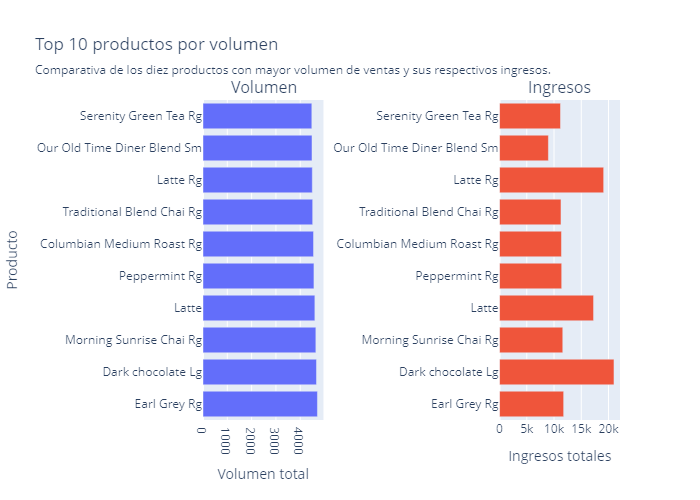

El coeficiente de variación ronda el 30%, lo que indica ingresos más dispersos respecto a la media; se puede apreciar claramente en la gráfica anterior donde el producto más vendido (*Earl Grey Rg*) no es precisamente quien genera los mayores ingresos entre los diez, este puesto lo ocupa el segundo producto que más vendido: *Dark chocolate Lg*. Es interesante notar que el séptimo producto más vendido: *Latte Rg*, es el segundo que mejores ingresos genera.

## Análisis por sucursal

En la siguiente gráfica se muestra la transacción promedio por sucursal

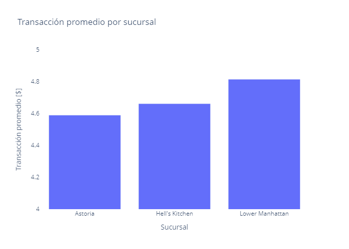

Donde no se aprecia una diferencia notable entre las sucursales.

Mostrando el ingreso neto por categoría:

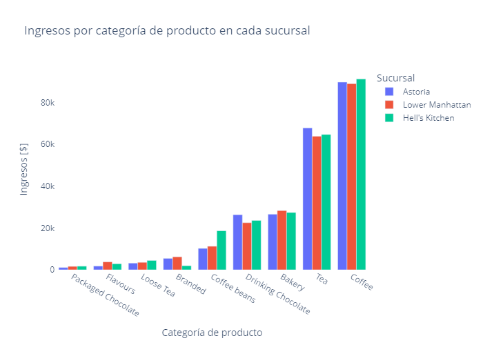

De donde se puede extraer lo siguiente:

- *Coffee* es la categoría dominante en cuanto a ingresos en las tres sucursales, no se aprecia una diferencia considerable entre los ingresos reportados para cada sucursal.

- En el caso de *Tea* se aprecia una ligera diferencia a favor de la sucrusal ubicada en Astoria.
- No se aprecia una diferencia considerable entre los ingresos.
- La sucursal *Hell's Kitchen* recibió mejores ingresos por los productos de *Coffee beans* respecto a las demás.
- Los productos *Branded* tuvieron mejores ingresos en *Astoria* y *Lower Mahattan*.

### ¿Qué tipo de producto tuvo los mejores ingresos?

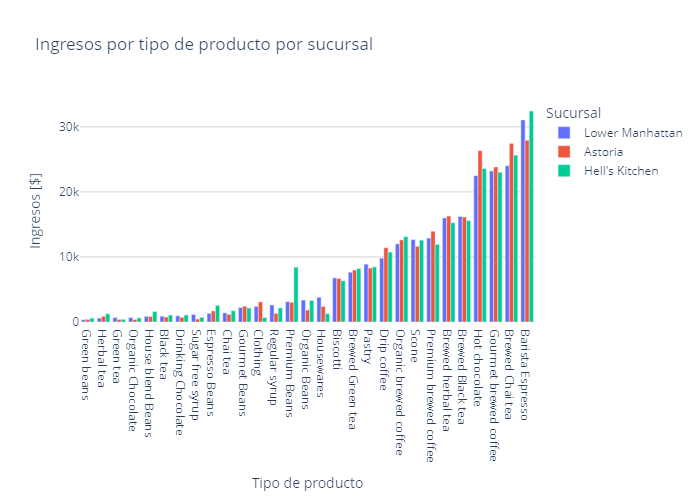

El *Barista Espresso* reportó más flujo de efectivo en la sucursal *Hell's Kithcen*, seguido, sin notable diferencia, por *Lower Manhatttan*, mientras que en la tienda de *Astoria* se tuvo un flujo significativamente menor.

El *Brewed Chai tea* reportó mejores ingresos en la sucursal de *Astoria*, en *Hell's Kitchen* se tuvo un menor flujo aunque no de manera significativa, mientras tanto, *Lower Manhattan* reporta de una manera moderada menores ingresos respecto a *Astoria*.

El caso del *Gourmet Brewed coffee* no se nota una diferencia menos significativa entre las tres sucursales, llegando a ser casi homogéneo la captación de ingresos.

Sobre los demás tipos de producto, es sobresaliente el caso de *Premium Beans*, donde *Hell's Kitchen* obtuvo mayores ingresos sobre las otras dos sucursales.

## Análisis temporal

El histórico de de ingresos totales

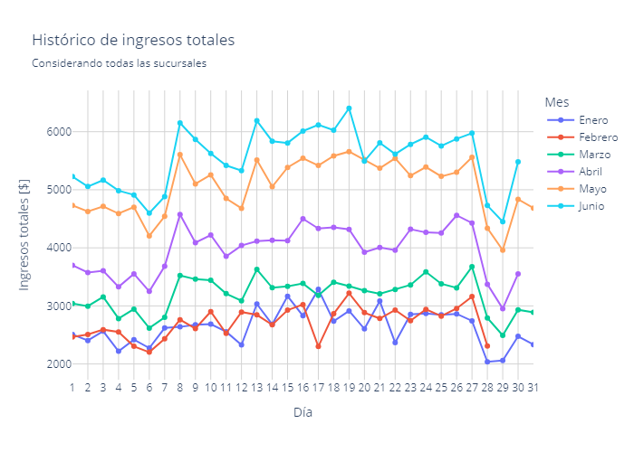

muestra que:
- Enero y febrero son los meses donde se registraron los menores ingresos en las tres sucursales.
- Por otro lado, mayo y junio fueron los mejores meses en ingresos para las tres cafeterías.
- Se observa una tendencia positiva en los ingresos para los meses de marzo, abril, mayo y junio a partir del día 7 de cada mes.
- Se observa una caida conjunta pero breve para todos los meses a partir del día 28.

Por otro lado, al analizar el ingreso promedio

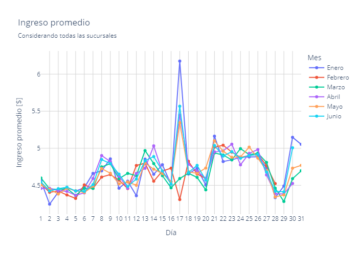

proporciona la siguiente información:

- Enero, abril, mayo y junio muestran un *pico* de ingreso promedio entre los días 16 y 18 de cada mes, siendo enero el máximo con un promedio de $6.1.
- Por otra parte, febrero en el mismo intervalo tiene la disminución más pronunciada de todos los meses.
- En el histórico de ingresos enero es quien reporta menor entrada de efectivo, pero en promedio parece estar junto a los demás meses, destacando por el 17 de enero el cual es el día con mejor facturación promedio.
- Marzo es el único mes que no presenta el pico de facturación media.
- Todos los meses parecen muestrar una tendencia negativa breve hacia el día 28.para luego remontar.

Desglosando por sucursal:

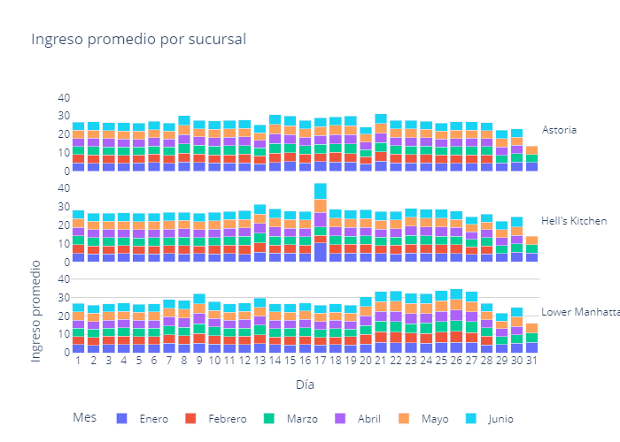

se obtiene que el día 17 muestra un aumento considerable en los ingresos, al desglosar por sucursal se nota que la contribución a este aumento viene de la sucursal *Hell's Kitchen* quien el día 17 de enero, abril, mayo y junio reportaron un aumento significativo en la facturación promedio.

En general, las tres sucursales tienen una facturación promedio relativamente homogénea a lo largo del mes.

### ¿Cómo se comportaron los ingresos a lo largo del día?

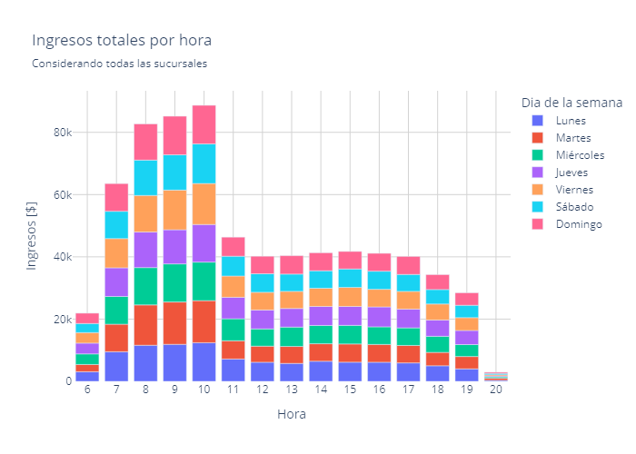

La hora de apertura de las sucursales ocurre a las 6 hrs., de 7 a 10 hrs. ocurre el máximo de ingresos. Pasadas las 11 y hasta las 17 hrs los ingresos son homogéneos durante todos los días. La hora del cierre ocurre a las 20 hrs. y los ingresos sufren una caída considerable por debajo de los $5K.

### Desempeño por sucursal
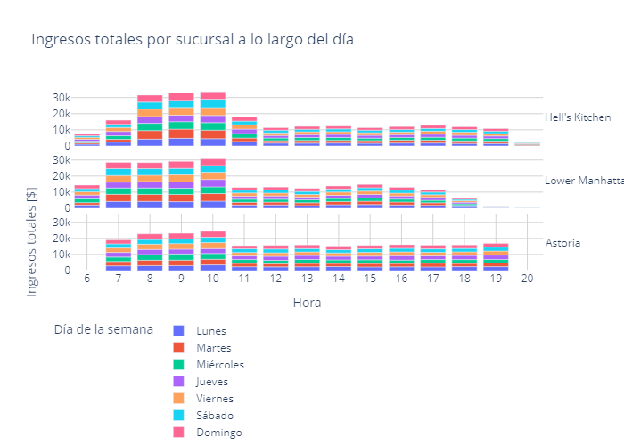

- La sucursal de Astoria tiene un horario de 7 a 20 hrs., en cambio, Hell´s Kitchen y Lower Manhattan abren de 6 a 20 hrs.
- Hell´s Kitchen tuvo un máximo de ingresos entre 8 y 10 hrs., de 12 a 19 hrs. los ingresos se mantienen estables a lo largo de los días. Llegando a las 20 hrs. la facturación total cayó por debajo de los $5K.
- Lower Manhattan tiene un máximo de ingresos más prologado, desde 6 hasta las 10 hrs. A partir de las 11 y hasta las 17 hrs los ingresos se mantienen estables para toda la semana. La caída abrupta de los ingresos ocurrió desde las 19 y hasta las 20 hrs. Esto puede indicar que dicha sucursal puede cerrar más temprano.
- Comparado con la otras dos sucursales, Astoria se comporta de manera más homogénea, desde su apertura se reportó un incremento en los ingresos hasta las 10 hrs. Pasado ese tiempo y hasta el cierre los ingresos se mantuvieron estables y homogéneos.

Analizando el ingreso promedio por sucursal a lo largo del día:

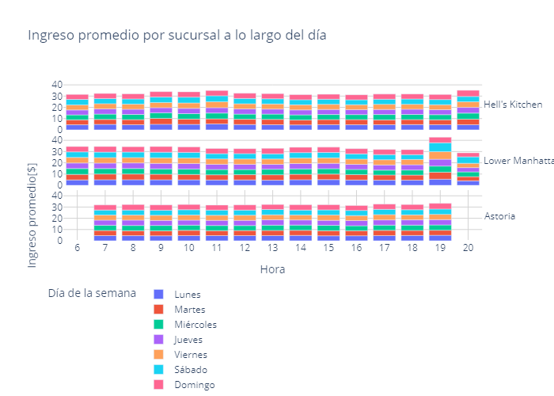

### Desempeño semanal

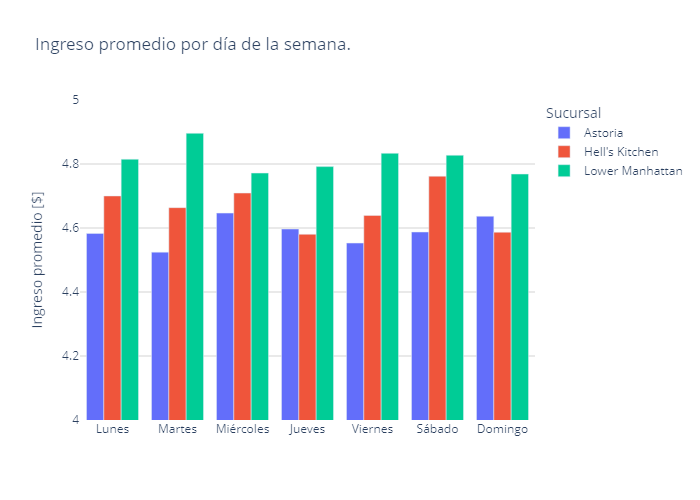

En promedio, Lower Manhattan tiene una facturación mayor durante toda la semana, siendo el martes su mejor día.

# Conclusiones

