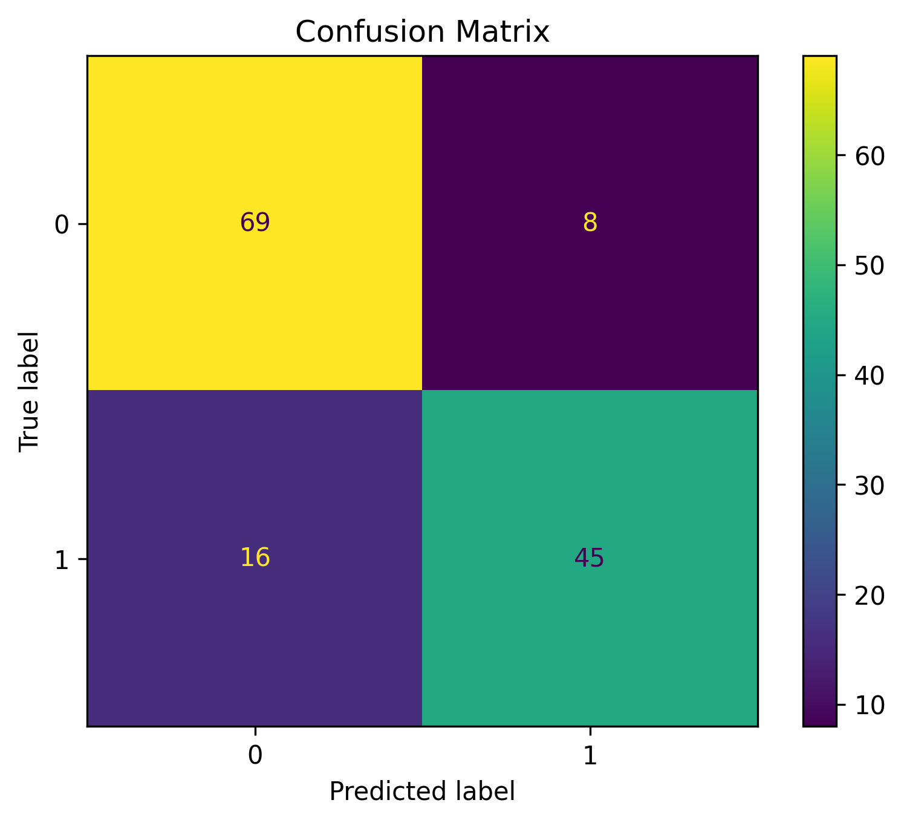

# Credit card approval prediction

This project presents an end-to-end machine learning pipeline for predicting credit card approval decisions using the UCI Credit Approval dataset. The project follows a modular architecture that separates data loading, cleaning, preprocessing, model training, and evaluation, leveraging scikit-learn's `Pipeline` and `ColumnTransformer` to build a reproducible and maintainable workflow.

## Problem Statement

Financial institutions receive a large number of credit card applications every day, making manual evaluation time-consuming and potentially inconsistent. Automating the approval process through machine learning can support faster, more objective, and data-driven decisions while maintaining predictive performance. 

The objective of this project is to build and evaluate a binary classification model capable of predicting whether a credit card application should be approved based on applicant attributes. The project emphasizes not only predictive performance but also the implementation of a modular, reproducible, and maintainable machine learning workflow following software engineering best practices.

## Dataset

This project uses the **Credit Approval** dataset from the **UCI Machine Learning Repository**, a benchmark dataset commonly used for binary classification tasks. The dataset contains demographic, financial, and application-related attributes of credit card applicants, with the goal of predicting whether an application should be approved.

**Dataset Summary**

- **Source:** UCI Machine Learning Repository
- **Instances:** 690
- **Features:** 15 input variables
- **Target Variable:** `Class`
- **Task:** Binary Classification

To preserve applicant privacy, all feature names and values have been anonymized in the original dataset. The dataset includes a mix of categorical and numerical variables, making it a suitable benchmark for demonstrating preprocessing techniques such as categorical encoding, feature scaling, and machine learning pipelines.

## Project Structure

The project is organized following a modular architecture to improve readability, maintainability, and scalability. Each module has a single responsibility, making it easier to extend the project with additional preprocessing techniques, models, or evaluation methods.

```text
credit-card-approval/
│
├── data/
│   ├── raw/                  # Original dataset
│   └── processed/            # Processed datasets
│
├── models/                   # Saved trained models
│
├── notebooks/                # Exploratory data analysis and experimentation
│
├── reports/                  # Figures and evaluation reports
│
├── src/
│   ├── config.py             # Project configuration
│   ├── data_loader.py        # Dataset loading
│   ├── data_cleaning.py      # Data cleaning functions
│   ├── data_split.py         # Train-test split
│   ├── preprocessing.py      # ColumnTransformer and preprocessing pipeline
│   ├── models.py             # Machine learning model definitions
│   ├── train.py              # Pipeline creation and model training
│   ├── evaluation.py         # Model evaluation metrics
│   └── main.py               # Main execution script
│
├── requirements.txt          # Project dependencies
└── README.md                 # Project documentation
```
## Workflow

The project follows a structured end-to-end machine learning workflow to ensure reproducibility and maintainability:

1. **Data Loading**
   - Load the raw dataset from the `data/raw` directory.

2. **Data Cleaning**
   - Remove duplicate records.
   - Handle missing values.

3. **Train-Test Split**
   - Split the dataset into training and testing subsets using stratified sampling.

4. **Feature Preprocessing**
   - Apply **Target Encoding** to selected categorical features.
   - Standardize numerical features using **StandardScaler**.
   - Combine all preprocessing steps with **ColumnTransformer**.

5. **Model Training**
   - Build a machine learning **Pipeline** integrating preprocessing and the classification model.
   - Train a Logistic Regression classifier.

6. **Model Evaluation**
   - Evaluate the trained model using:
     - Accuracy
     - Precision
     - Recall
     - F1-score
     - Confusion Matrix
     - Classification Report
## Technologies

The project was developed using the following technologies and libraries:

| Category | Technologies |
|----------|--------------|
| Programming Language | Python 3 |
| Data Manipulation | Pandas, NumPy |
| Machine Learning | Scikit-learn |
| Data Preprocessing | ColumnTransformer, Pipeline, TargetEncoder, StandardScaler |
| Model | Logistic Regression |
| Development Environment | Jupyter Notebook, Visual Studio Code |
| Version Control | Git, GitHub |

## Models

The current version of the project implements a **Logistic Regression** classifier as the baseline model. The model is integrated into a **scikit-learn Pipeline**, ensuring that all preprocessing steps are consistently applied during both training and inference.

### Implemented Model

| Model | Status |
|--------|:------:|
| Logistic Regression | ✅ |

The modular architecture allows additional machine learning algorithms to be incorporated with minimal code changes. Future versions of the project will include models such as Random Forest, Gradient Boosting, and XGBoost for performance comparison and hyperparameter optimization.

## Results

The baseline Logistic Regression model achieved strong performance on the test set, demonstrating its ability to correctly classify credit card applications while maintaining a high recall for the positive class.

### Performance Metrics

| Metric | Score |
|---------|------:|
| Accuracy | **0.877** |
| Precision | **0.814** |
| Recall | **0.934** |
| F1-score | **0.870** |

The high recall indicates that the model successfully identifies most approved credit card applications, while the F1-score reflects a good balance between precision and recall.

### Classification Report

| Class | Precision | Recall | F1-score |
|------:|----------:|--------:|---------:|
| 0 | 0.90 | 0.83 | 0.86 |
| 1 | 0.81 | 0.93 | 0.87 |

### Confusion Matrix



## How to Run

### 1. Clone the repository

```bash
git clone https://github.com/your-username/credit-card-approval.git
cd credit-card-approval
```

### 2. Create a virtual environment (recommended)

**Anaconda**
```bash
conda env create -f environment.yml
conda activate machine_learning_env
```

### 3. Run the project

```bash
python src/main.py
```

The script will:

- Load the dataset
- Clean the data
- Split the dataset into training and testing sets
- Apply feature preprocessing
- Train the Logistic Regression model
- Evaluate the model and display the performance metrics


## Future Improvements

The current implementation serves as a solid baseline for a modular machine learning workflow. Future versions of the project will focus on improving both model performance and software quality.

- [ ] Hyperparameter optimization using GridSearchCV and RandomizedSearchCV.
- [ ] Implement additional classification models (Random Forest, XGBoost, LightGBM).
- [ ] Model persistence using `joblib`.
- [ ] Feature importance and model explainability with SHAP.
- [ ] ROC Curve and Precision-Recall Curve visualization.
- [ ] Automated experiment tracking.
- [ ] Unit tests for individual modules.
- [ ] Logging system for training and evaluation.
- [ ] Configuration management using YAML files.
- [ ] Continuous Integration (CI) with GitHub Actions.

## Author

**Luis Gerardo Ramírez Archundia**

Physics graduate transitioning into Data Science and Machine Learning. I enjoy transforming data into actionable insights and developing end-to-end machine learning projects with a focus on clean architecture, reproducibility, and best practices.

Feel free to connect with me or explore my other projects:

- **GitHub:** https://github.com/sirlluis
- **LinkedIn:** https://www.linkedin.com/in/lgra1525
- **Email:** luisgra@tuta.io

